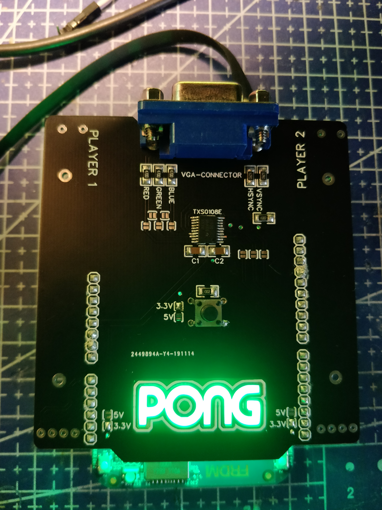

# MBED-VGA-PONG

## Inleiding
Het is de bedoeling om een scherm aan te sturen via VGA en op dit scherm het klassieke pong spel te spelen. Het spelen van het spel kan aan de hand van potentiometers en het spel starten aan de hand van een knop. 

## Te gebruiken tools
+ Mbed FRDM-K64F
+ Scherm met VGA connectie
+ Zelfgemaakt bordje met VGA connector + potentionmeters + knop (optioneel)
+ MCUXpresso IDE

## Functional Requirement Specifications (FRS)
### pong
Het spel pong bevat twee balken die elk door een speler bediend kunnen worden. De spelers moeten met de balken een bal terugkaatsen naar de andere speler. Als de bal voorbij een balk van speler gaat, dan verdiend de andere speler een punt. Dit spel is dus eigenlijk ping pong in digitale versie. 

### 3-tier approach
1. Driver layer:
    + VGA driver:
    Deze driver moet ervoor zorgen dat het spel afgebeeld wordt op het scherm. Voor een scherm aan te sturen via VGA hebben we vijf pinnen nodig. Twee klok pinnen en drie pinnen voor de kleuren, namelijk rood, groen en blauw. De pinnen die moeten aangestuurd worden voor de kleuren zijn pin één (rood), twee (groen) en drie (blauw). De klok pinnen dienen om de horizontale en verticale sync aan te sturen. Dit zijn respectievelijk pin 13 en 14.
    
    
    + Driver voor een knop:
    We zullen een knop nodig hebben die het spel reset en vervolgens start. Deze driver zal een debouncer nodig hebben die het trillen van de knop tegen gaat bij het indrukken en loslaten. De debouncer zal een delay gebruiken vooraleer het de waarde inleest.

    + Driver voor potentiometer:
    Er zullen twee potentiometers gebruikt worden om het spel te spelen. Elke speler maakt gebruik van één potentiometer. De driver voor de potentiometer zal dus de juiste waarden moeten inlezen.

2. Middleware: 
    In de middleware zullen de waardes verkregen van de drivers en/of top layer omgerekend worden naar waardes die bruikbaar zijn voor de drivers of voor de top layer.
    + De waardes verkregen van de potentiometer zullen omgezet moeten worden naar bruikbare waardes. Deze zullen doorgegeven worden aan de top layer en bepalen welke positie de balkjes van de spelers op het scherm krijgen.
    + De waarde van de knop zal moeten doorgegeven worden van de drivers naar de top layer via de middleware. Dit zodat de top layer weet wanneer hij het spel moet resetten en starten.
    + In de top layer wordt de positie bepaald van de balkjes en de bal. Deze positie moet doorgegeven worden van de top layer naar de VGA driver via de middleware. Ook moeten de juiste kleuren doorgegeven worden aan de VGA driver.

3. Top layer:
    De top layer zal het volledige pong spel bevatten. Het spel zal aangestuurd worden door 2 states, namelijk een reset en een start state. Wanneer er op de knop gedrukt wordt, zal het spel eerst resetten en dan starten. In de reset state wordt alles klaargezet voor de spelers vooraleer het spel start. In de reset state wordt bijvoorbeeld de bal terug in het midden van het speelveld gezet, de scores worden teruggezet op nul, de balkjes van de spelers worden opnieuw gesynchroniseerd met de posities van de potentiometers,...
    In de start state zal het spel van start gaan. De bal wordt in een random richting gestuurd en de spelers kunnen de balkjes gebruiken om hun speelveld te beschermen.

### Maken van shield met VGA connectie (optioneel)
Omdat het mbed F64-K bordje geen VGA connector heeft, kan er een shield gemaakt worden die op dit bordje past. De shield zou dan een VGA connectie bevatten, maar ook een knop en twee potentiometers. Indien dit niet lukt, kan er gebruik gemaakt worden van jumper wires en een breadbord om de connecties te maken.

## Referenties figuren
+ pong. (2019, oktober 1). pong. Opgehaald van pong: http://cl.k12.md.us/cctc/programs/digital/pong.html
+ Wikipedia. (2019, augustus 4). VGA connector. Opgeroepen op oktober 1, 2019, van WIkipedia: https://en.wikipedia.org/wiki/VGA_connector

